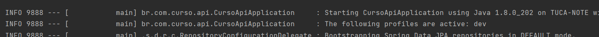

# curso-api

API:

O que é: Application Programming Interface - Interface de Programação de Aplicação - Ou seja, é um conjunto de normas que possibilita a comunicação, troca de informações entre plataformas.


Endpoint:

Na tradução literal significa o "ponto final", que é o caminho onde você irá disponibilizar o acesso à sua aplicação.
Você disponibiliza vários pontos(endpoints) para:
- Consultar informações(GET)
- Alterar informações(PUT)
- Inserir informações(POST)
- Deletar informações(DELETE)


@RestController - Anotação usada para classes(componentes) de controladores para projetos serviçoes RESTFul, nada mais é do que o mesmo que anotar uma classe com:
@Controller + @ResponseBody

@RequestMapping - Anotação usada para mapear o caminho da classe que possui as requisições.
Exemplo:
```
@RestController
@RequestMapping("/teste")
public class TesteController {

}
```

@GetMapping - Anotação usada para mapear uma requisição do tipo HTTP GET. Basicamente é um atalho para você não ter que usar assim:
@RequestMapping(method = RequestMethod.GET)
Exemplo:
```
@RestController
@RequestMapping("/teste")
public class TesteController {

	@GetMapping("/oi")
	public String getOi() {
		return "Oi Pessoal!";
	}
	
}
```
Ou seja, para acessar a requisição específica, a url ficaria: http://localhost:8080/teste/oi
Na classe acima, podemos dizer que temos um endpoint.

ResponseEntity - Utilizado para retornar uma resposta mais completa. Representa toda resposta HTTP. Você pode controlar: status(http status), cabeçalho(header) e corpo(body).
```
@RestController
@RequestMapping("/cursos")
public class CursoController {
	
	@Autowired
	private CursoService cursoService;
	
	@GetMapping
	private ResponseEntity<List<Curso>> getCursos() {
		List<Curso> cursosList = cursoService.getCurso();
		
		return ResponseEntity.ok().body(cursosList);
	}

}
```
---------------------------------------

Para definir perfis diferentes, por exemplo, 
executar o  sistema apontando para ambientes diferentes(dev, uat, prd)

Devemos criar um arquivo properties para cada perfil. ex:

application-dev.properties
application-uat.properties
application-prd.properties

o arquivo application.properties é o principal do projeto e é nele que será setado
para qual arquivo deverá apontar.

o application.properties ficaria assim:

```
spring.profiles.active=dev
```

É possivel verificar qual profile está sendo executado no console ao startar o projeto:



__________________________________________________________________________
@Profile - Anotação para definir em que profile(dev, uat, prd, local) uma classe é executada. 
Para definir uma classe que será executada ao rodar o programa de acordo com o profile, podemos criar uma classe
da seguinte maneira:

```
@Profile("local")
@Component
public class TestDatabase implements CommandLineRunner {

    @Autowired
    CursoRepository cursoRepository;

    @Override
    public void run(String... args) throws Exception {

        Curso curso1 = new Curso("Graduação em TI", "Exatas");
        Curso curso2 = new Curso("Graduação em Economia", "Humanas");
        Curso curso3 = new Curso("Graduacao em Administração", "Humanas");
        Curso curso4 = new Curso("Graduação em Educação Física", "Humanas");

        cursoRepository.save(curso1);
        cursoRepository.save(curso2);
        cursoRepository.save(curso3);
        cursoRepository.save(curso4);
    }
}
```

Ao rodar a aplicação setando profile local, essa classe será executada, realizando insert na tabela.

strategy de criacao (cria tabelas ao rodar o projeto)
```
spring.jpa.hibernate.ddl-auto=create
```
Para não ficar criando as tabelas todas as vezes, basta setar desta forma:
```
spring.jpa.hibernate.ddl-auto=none
```

@BeforeAll - Ao anotar um método na classe de teste com essa annotation, o método será executado
antes de tudo o que estiver na classe.
Ex:
```
@BeforeAll
    void antesDeTudo() {
        System.out.println("Classe de teste Cuso iniciando...");
    }
```
Quando utilizada essa annotation, o método deverá ser static, ou a classe deverá ser anotada com @TestInstance(Lifecycle.PER_CLASS)
isso quer dizer que que o ciclo de vida será executado por classe.
Ex:
```
@TestInstance(TestInstance.Lifecycle.PER_CLASS)
class CursoTest {
}
```


@BeforeEach - Ao anotar um método na classe de teste com essa annotation, antes de cada método executado
o método anotado será executado.
Ex: 
```
 @BeforeEach
    void antesDeCadaMetodo(){
        System.out.println("Antes de cada método...");
        curso = new Curso();
    }
```

@AfterEach - Ao anotar um método na classe de teste com essa annotation, após cada método executado
o método anotado será executado.
Ex:
```
 @AfterEach
    void depoisDeCadaMetodo(){
        System.out.println("[USANDO JUNIT] - Nome do Curso " + curso.getNome());
    }
```

@AfterAll - Ao anotar um método na classe de teste com essa annotation, no final da execução de toda classe
o método anotado será executado.
Ex:
```
@AfterAll
    void depoisDeTudo(){
        System.out.println("[USANDO JUNIT] - Classe de teste finalizada...");
    }
```


